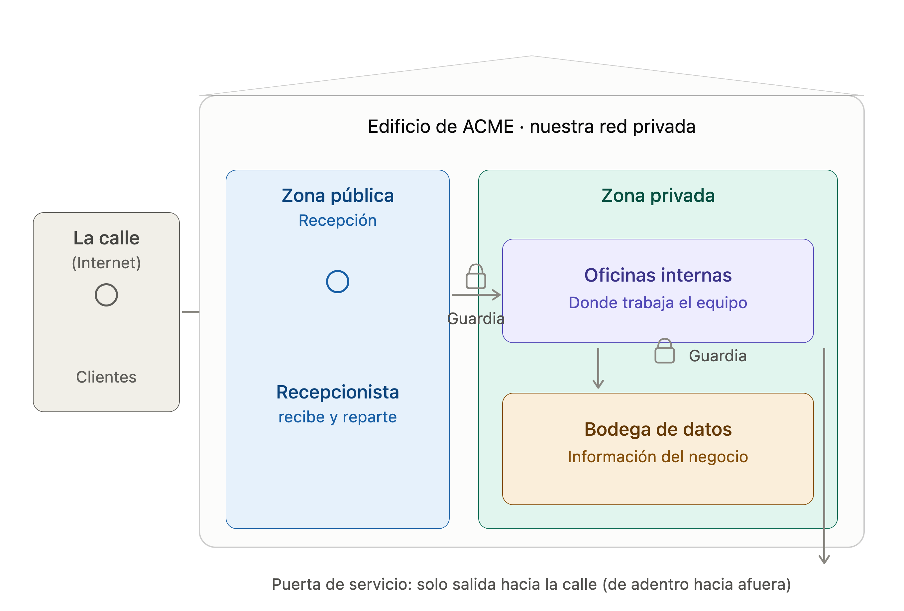
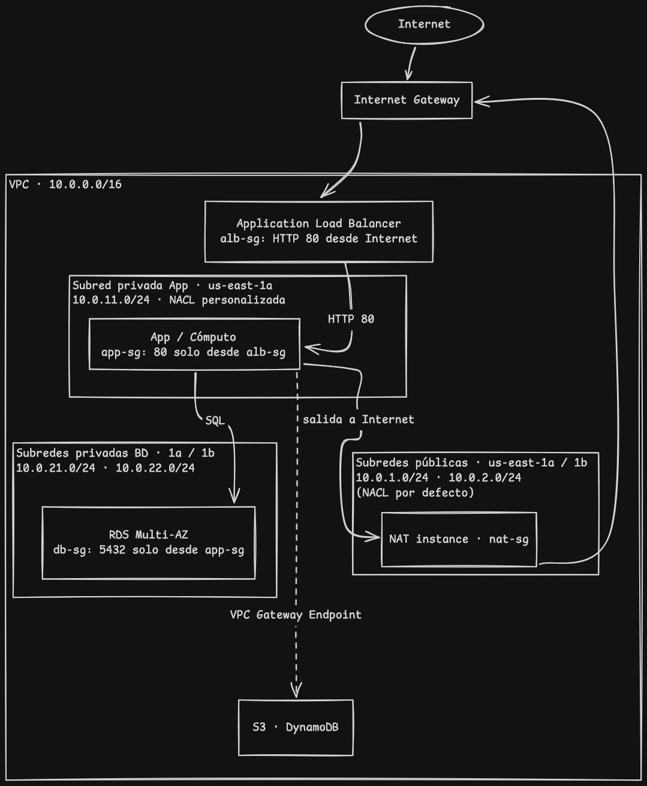

# 05 - Servicio de red en la nube

## Propuesta de servicio de red en la nube

Imagina que ACME alquila un edificio propio y cercado en la nube. Ese edificio es nuestra red privada: nadie de afuera entra a menos que lo dejemos pasar por la puerta correcta.
El edificio tiene dos zonas. Una recepción de cara a la calle, que es la única parte que el público puede ver, y unas oficinas internas al fondo, donde está lo valioso —los empleados trabajando y los archivadores con la información del negocio— a las que el público jamás llega directamente.

Cuando un cliente entra por la puerta, no camina por donde quiere: lo recibe un recepcionista que lo atiende y lo dirige. Si mañana llegan diez veces más clientes, ponemos más recepcionistas y la atención no se cae. Ese recepcionista es el único expuesto al exterior; protege todo lo de atrás.

Para que nadie se cuele, hay guardias en cada puerta: a las oficinas internas solo se entra si vienes derivado por recepción, y los archivadores con los datos del negocio solo los abre el personal autorizado. Doble control, por si un guardia falla.

Los empleados, cuando necesitan algo de la calle (una actualización, un proveedor), salen por una puerta de servicio que solo abre hacia afuera: ellos pueden salir, pero nadie entra por ahí. Y para llegar a la bodega de archivos pesados (fotos, documentos, históricos) usan un pasillo interno privado, sin tener que pisar la calle, lo cual es más seguro y además no nos cuesta nada.

Eso es todo. En una frase: construimos un edificio donde lo público y lo privado están separados, con recepción y guardias, de modo que el negocio escala, está protegido y gasta lo justo.

## Documentación Técnica

Una sola VPC con un tier público (expuesto a Internet, donde vive el balanceador) y un tier privado (donde vive la aplicación / base de datos, sin acceso directo desde Internet). El balanceador recibe el tráfico web y lo reparte hacia el backend privado.

Este diseño cumple con:

Acceso externo restringido: El ALB mediante el puerto 80 es el único punto de entrada público, protegiendo los servicios internos de cualquier conexión directa desde Internet.
Aislamiento en subredes privadas: Las aplicaciones y bases de datos operan en entornos aislados. Mientras la app gestiona actualizaciones vía NAT Gateway, la base de datos permanece totalmente desconectada del tráfico exterior.
Defensa en profundidad: Se integran Security Groups para un control stateful por recurso y NACL como filtrado stateless a nivel de red.
Conectividad privada vía Endpoints: La comunicación con S3 y DynamoDB se realiza a través de la infraestructura interna de AWS, omitiendo el uso de Internet o NAT, optimizando la seguridad y reduciendo costos operativos.
Descripción de componentes
Componente	Para qué sirve aquí	Tipo
VPC	Red aislada propia con rango IP privado	Red base
Subred pública	Aloja el ALB y el NAT; tiene ruta al IGW	Segmentación
Subred privada	Cómputo sin acceso público directo	Segmentación
Internet Gateway (IGW)	Entrada/salida a Internet de las subredes públicas	Conectividad
NAT Gateway	Permite salida a Internet de la subred privada sin exponerla	Conectividad
Route Tables	Definen quién enruta al IGW (pública) y quién al NAT (privada). Pública → IGW; privada → NAT	Enrutamiento
Security Groups	Firewall stateful por recurso	Seguridad
NACL	Filtro stateless por subred	Seguridad
VPC Gateway Endpoints	Acceso privado a S3 y DynamoDB	Conectividad
Application Load Balancer	Distribuye el tráfico HTTP hacia los targets	Balanceo
VPN Site-to-Site	No aplica	Conectividad híbrida
El servicio de VPN Site-to-Site permite establecer un túnel IPSec seguro entre una infraestructura local y la VPC. No obstante, dado que el proyecto plantea una transición íntegra hacia entornos cloud, se prescinde de su implementación al no existir un centro de datos físico que requiera conexión constante. Esta tecnología sería pertinente únicamente si la organización conservase aplicaciones legadas on-premise que demanden comunicación privada con la nube.

Reglas de seguridad
#	Capa	Recurso	Regla
1	Security Group	alb-sg (entrada)	TCP 80 desde 0.0.0.0/0 (Internet → ALB)
2	Security Group	app-sg (entrada)	TCP 80 desde alb-sg (solo el ALB llega a la app)
3	NACL privada	entrada	ALLOW TCP 80 desde 10.0.0.0/16
4	NACL privada	salida	ALLOW TCP 1024-65535 hacia 10.0.0.0/16 (retorno stateless)
Implementación en AWS (cli)
Revisar implementación con scripts en repositorio:
[Implementación de la red](./network-implementation.sh)
[Limpieza de implementación de red](./remove-network.sh)

El script implementa una VPC estructurada con niveles de seguridad diferenciados (público, aplicación privada y base de datos aislada), asegurando la conectividad de la capa privada mediante una instancia NAT. La arquitectura optimiza el tráfico hacia S3 y DynamoDB mediante el uso de Endpoints, sienta las bases para una base de datos RDS con configuración Multi-AZ y publica el servicio a través de un Load Balancer. Este diseño constituye el núcleo de red fundamental sobre el cual se desplegarán las instancias EC2 y los servicios gestionados de ACME.
