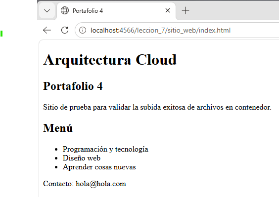

# 07 - Alojamiento web y contenidos

Paso a paso usado para simular alojamiento web en Floci.

Antes de comenzar, Floci debe estar corriendo y la AWS CLI debe apuntar a `http://localhost:4566`.

Para que no haya problemas en la ejecución de comandos, se debe configurar AWS CLI

```
$env:AWS_ENDPOINT_URL="http://localhost:4566"
$env:AWS_ACCESS_KEY_ID="test"
$env:AWS_SECRET_ACCESS_KEY="test"
$env:AWS_DEFAULT_REGION="us-east-1"
```


## Pasos

1. Crear un bucket S3 ([01_create_bucket_S3.sh](./01_create_bucket_S3.sh)):

```
aws s3 mb s3://leccion_7 --endpoint-url=http://localhost:4566
```

2. Crear capeta que alojará el archivo HTML ([02_create_folder.sh](./02_create_folder.sh)):

```
aws s3api put-object --bucket leccion_7 --key sitio_web/
```

3. Subir archivo index.html y comprobar ([03_upload_file.sh](./03_upload_file.sh)):

```
 aws s3 cp index.html s3://leccion_7/sitio_web/index.html --endpoint-url http://localhost:4566
```

```
 aws s3 ls s3://leccion_7/sitio_web/ --endpoint-url http://localhost:4566
```

Validar que la página web se vea




4. Debido a que no existe Cloud Front como tal en Floci, se debe crear un archivo json para configurar distribución ([dist_config.json](./dist_config.json)):

```
{
  "CallerReference": "test-distribution-1",
  "Comment": "Mi CDN local en Floci",
  "Enabled": true,
  "Origins": {
    "Quantity": 1,
    "Items": [
      {
        "Id": "S3-Leccion_7",
        "DomainName": "leccion_7.localhost.localstack.cloud",
        "S3OriginConfig": {
          "OriginAccessIdentity": ""
        }
      }
    ]
  },
  "DefaultCacheBehavior": {
    "TargetOriginId": "S3-Leccion_7",
    "ViewerProtocolPolicy": "allow-all",
    "TrustedSigners": {
      "Quantity": 0,
      "Enabled": false
    },
    "ForwardedValues": {
      "QueryString": false,
      "Cookies": {
        "Forward": "none"
      },
      "Headers": {
        "Quantity": 0
      },
      "QueryStringCacheKeys": {
        "Quantity": 0
      }
    },
    "MinTTL": 0
  }
}
```


5. Ejecutar json y validar distribución ([04_dist_config.sh](./04_dist_config.sh)):
```
aws cloudfront create-distribution --distribution-config file://dist-config.json --endpoint-url http://localhost:4566 --no-verify-ssl
```

```
aws cloudfront list-distributions --endpoint-url http://localhost:4566 --no-verify-ssl
```
