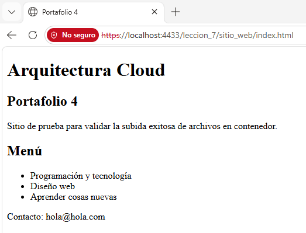

# 07 - Alojamiento web y contenidos

Paso a paso usado para simular alojamiento web en Floci.

Antes de comenzar, Floci debe estar corriendo y la AWS CLI debe apuntar a `http://localhost:4566`.

Para que no haya problemas en la ejecución de comandos, se debe configurar AWS CLI

```
$env:AWS_ENDPOINT_URL="http://localhost:4566"
$env:AWS_ACCESS_KEY_ID="test"
$env:AWS_SECRET_ACCESS_KEY="test"
$env:AWS_DEFAULT_REGION="us-east-1"
```

## Pasos

1. Crear un bucket S3 ([01_create_bucket_S3.sh](./01_create_bucket_S3.sh)):

```
aws s3 mb s3://leccion_7 --endpoint-url=http://localhost:4566
```

2. Crear capeta que alojará el archivo HTML ([02_create_folder.sh](./02_create_folder.sh)):

```
aws s3api put-object --bucket leccion_7 --key sitio_web/
```

3. Subir archivo index.html y comprobar ([03_upload_file.sh](./03_upload_file.sh)):

```
 aws s3 cp index.html s3://leccion_7/sitio_web/index.html --endpoint-url http://localhost:4566
```

```
 aws s3 ls s3://leccion_7/sitio_web/ --endpoint-url http://localhost:4566
```

Validar que la página web se vea


4. Debido a que no existe Cloud Front como tal en Floci, se debe crear un archivo json para configurar distribución ([dist_config.json](./dist_config.json)):

```
{
  "CallerReference": "test-distribution-1",
  "Comment": "Mi CDN local en Floci",
  "Enabled": true,
  "Origins": {
    "Quantity": 1,
    "Items": [
      {
        "Id": "S3-Leccion_7",
        "DomainName": "leccion_7.localhost.localstack.cloud",
        "S3OriginConfig": {
          "OriginAccessIdentity": ""
        }
      }
    ]
  },
  "DefaultCacheBehavior": {
    "TargetOriginId": "S3-Leccion_7",
    "ViewerProtocolPolicy": "allow-all",
    "TrustedSigners": {
      "Quantity": 0,
      "Enabled": false
    },
    "ForwardedValues": {
      "QueryString": false,
      "Cookies": {
        "Forward": "none"
      },
      "Headers": {
        "Quantity": 0
      },
      "QueryStringCacheKeys": {
        "Quantity": 0
      }
    },
    "MinTTL": 0
  }
}
```


5. Ejecutar json y validar distribución ([04_dist_config.sh](./04_dist_config.sh)):

```
aws cloudfront create-distribution --distribution-config file://dist-config.json --endpoint-url http://localhost:4566 --no-verify-ssl
```

```
aws cloudfront list-distributions --endpoint-url http://localhost:4566 --no-verify-ssl
```

6. Configurar certificados 

Como no es posible realizarlo directamente en floci, se debe instalar nginx para utilizarlo como puente.
a. Generar archivo nginx.conf ([nginx.conf](./nginx.conf))

```
events { worker_connections 1024; }

http {
    server {
        listen 4433 ssl;
        server_name localhost;

        ssl_certificate /etc/nginx/certs/server.crt;
        ssl_certificate_key /etc/nginx/certs/server.key;

        ssl_protocols TLSv1.2 TLSv1.3;
        ssl_ciphers HIGH:!aNULL:!MD5;

        location / {
            proxy_pass http://floci-backend:4566;
            proxy_set_header Host $host;
            proxy_set_header X-Real-IP $remote_addr;
            proxy_set_header X-Forwarded-For $proxy_add_x_forwarded_for;
            proxy_set_header X-Forwarded-Proto $scheme;
            client_max_body_size 0; 
        }
    }
}
```

b. Utilizar un contenedor temporal de Linux para que genere los certificados y los guarde directamente en carpeta actual ([05_alpine.sh](./05_alpine.sh))

```
 docker run --rm -v "${PWD}:/export" alpine sh -c "apk add --no-cache openssl && openssl req -x509 -newkey rsa:4096 -keyout /export/server.key -out /export/server.crt -days 365 -nodes -subj '/CN=localhost'"
```

c. Como floci no permite configurar un SSL en un bucket ya creado, se debe eliminar cualquier contenedor o red vieja que se llame igual ([05_remove.sh](./05_remove.sh))

```
 docker rm -f floci floci-ssl floci-backend nginx-proxy

 docker network rm floci-network

 docker network create floci-network
```

d. Se crea la red virtual para que se comuniquen entre sí ([05_virtual_network.sh](./05_virtual_network.sh))

```
docker network create floci-network
```

e. Encender Floci en su modo nativo estable ([05_alpine.sh](./05_alpine.sh))

```
 docker run -d --name floci-backend --network floci-network -p "4566:4566" -v floci-data:/var/lib/floci floci/floci:latest
```

f. Encender Nginx, pasándole los certificados generados y la configuración ([05_alpine.sh](./05_alpine.sh))

```
 docker run -d --name nginx-proxy --network floci-network -p "4433:4433" -v "${PWD}/nginx.conf:/etc/nginx/nginx.conf:ro" -v "${PWD}/server.crt:/etc/nginx/certs/server.crt:ro" -v "${PWD}/server.key:/etc/nginx/certs/server.key:ro" nginx:alpine
```

g. Volver a ejecutar los pasos 1, 2 y 3 de esta sección indicados anteriormente

h. Validar


